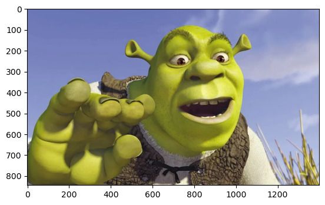
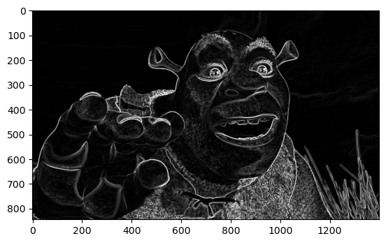

# Задания по курсу CUDA

## **Лабораторная работа 1:**

**реверс вектора:**

$[x_1, x_2, ..., x_n] -> [x_n, x_{n-1}, ..., x_1]$

## **Лабораторная работа 2:**

**применение свёртки Собеля к изображению:**

```python
M_X = np.array(
    [[-1, 0, 1], 
     [-2, 0, 2], 
     [-1, 0, 1]]
)

M_Y = np.array(
    [[-1, -2, -1], 
     [0, 0, 0], 
     [1, 2, 1]]
)
```
$G_x = w_{13} + w_{23} + w_{33} - w_{11} - w_{21} - w_{31}$

$G_y = w_{31} + w_{32} + w_{33} - w_{11} - w_{12} - w_{13}$

На место каждого пикселя записываем значение градиента в данной точке: 

$G = \sqrt{G_x^2 + G_y^2}$

**результат:**






## **Лабораторная работа 3:**

**классификация пикселей изображения методом спектрального угла:**

- для некоторого пикселя $p \in R^3, p = [R, G, B]$, номер класса $j_c$ определяется следующим образом:
$j_c = argmax_j[p^T * \frac{avg_i}{||avg_i||}]$